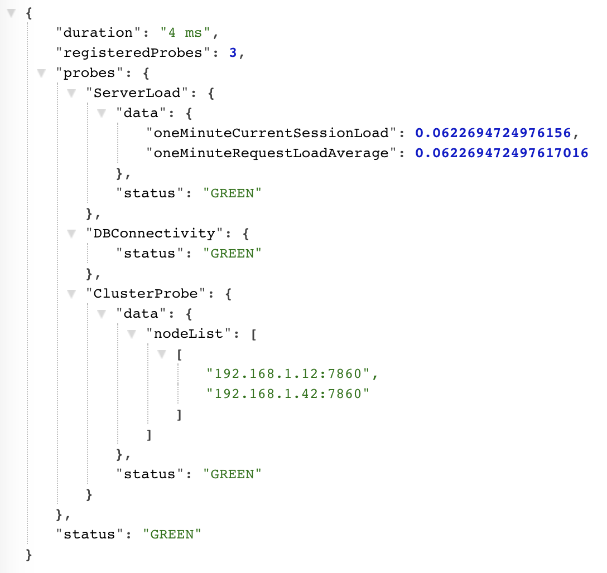

# healthcheck

Healthchecks provide insights about a platform's health and can help trigger alerts or pay attention to key components that might need close attention. Jahia's Healthcheck module provides a JSON output and it can be triggered at will with minimal impact on the platform load.

The healthcheck module is a core component that can be used in conjunction with extension modules in order to provide more information to the monitoring systems.

The healthcheck module returns a global status for the server, as well a status for all tested components. The status can be:
 * GREEN (Nominal status)
 * YELLOW (Non critical problem)
 * RED (Critical issue)

## Usage

The healthcheck is available through the servlet `/healthcheck` to all users who are granted the Jahia DX server role `monitoring`.  
If you need to make the servlet reachable without authentication, then you can add `modules.healthcheck.allowUnauthenticatedAccess = true` 
to your `jahia.properties` file. Then it is your responsibility to secure the access to the servlet in your frontend.   
It returns a JSON object with the following structure:



## Prerequisite

The Healthcheck module works on any Jahia DX 7.2+ platform.

## Configuration

The module can be configured using Karaf configuration

Create a *org.jahia.modules.healthcheck-core.cfg* file under digital-factory-data/karaf/etc

#### Authentication token

```
healthcheck.token = <Alphanumeric String>
```

As an alternative, a `healthcheck.token` properties can also be defined in jahia.properties. The Karaf based configuration will take precedence over the jahia.properties one if both are defined.

Once the token is defined, the healthcheck URL can be called by passing the token as a GET parameter:
http://127.0.0.1:8080/healthcheck?token=abcd

#### Configure the HTTP code returned when the healthcheck is RED

The default value is 500 (SERVICE UNAVAILABLE). This default can be overloaded with the following property:

```
healthcheck.http_code_on_error = 503
```

#### Session Load and Request Load status thresholds

The following configuration can be deployed in the Karaf configuration file, and thresholds adjusted

```
healthcheck.request_load_yellow_threshold = 40
healthcheck.request_load_red_threshold = 70
healthcheck.session_load_yellow_threshold = 40
healthcheck.session_load_red_threshold = 70
```

All properties are optional and will take the above values if not defined.

## Extensions

While the core healthcheck provide basic capabilities such as database connectivity and server load, additional modules can extend its capabilities. When deploying a proper healthcheck module extension, the healthcheck servlet will automatically be added with the new information. 

A typical Healthcheck extension is the healcheck-cluster module.

## Custom extensions

Developping a custom extension is straightforward and can be done in two different ways:
 - Forking the healcheck-extensionexample module (https://github.com/Jahia/healcheck-extensionexample)
 - Manually declarating an OSGi service and implementing a Java interface (described bellow)
 
### Steps to creating a Healthcheck extension:
#### 1. Updating the pom.xml file
 
Add the following elements to the pom file:
 
    <dependencies>
        <dependency>
            <groupId>org.jahia.modules</groupId>
            <artifactId>healthcheck</artifactId>
            <version>[1.0,2.0]</version>
            <scope>provided</scope>
        </dependency>
    </dependencies>


    <properties>
        <jahia-depends>default</jahia-depends>
        <jahia-module-type>system</jahia-module-type>
        <import-package>org.jahia.modules.healthcheck.interfaces</import-package>
    </properties>

    <build>
        <plugins>
            <plugin>
                <groupId>org.apache.felix</groupId>
                <artifactId>maven-bundle-plugin</artifactId>
                <extensions>true</extensions>
                <configuration>
                    <instructions>
                        <Jahia-Depends>default, healthcheck</Jahia-Depends>
                        <_dsannotations>*</_dsannotations>
                    </instructions>
                </configuration>
            </plugin>
        </plugins>
    </build>
    
 #### 2. Create a new Java Class
 
 In the extensionexample module, we decided to create a `org.jahia.modules.healthcheckexample.probes` package and a `ProbeExample.java` file.
 
 #### 3. Create a Probe OSGi service
 
In the Java Class previously created, implement the `Probe` interface (`org.jahia.modules.healthcheck.interfaces.Probe`) and declare a new Probe service:  

```
import org.osgi.service.component.annotations.Component;
import org.jahia.modules.healthcheck.interfaces.Probe;


@Component(service = Probe.class, immediate = true)
public class ProbeExampleService implements Probe {
   ...
}
```

Then, implement all 3 methods:

```
@Override
public String getStatus() {
    ...
    return "GREEN";
}

@Override
public JSONObject getData() {
    // Contains potential error messages. Return null if no message is necessary
    return jsonObject;
}

@Override
public String getName() {
    return "ProbeExample";
}
```
